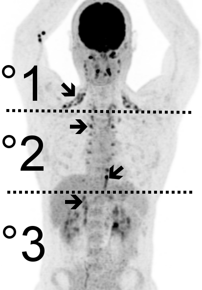
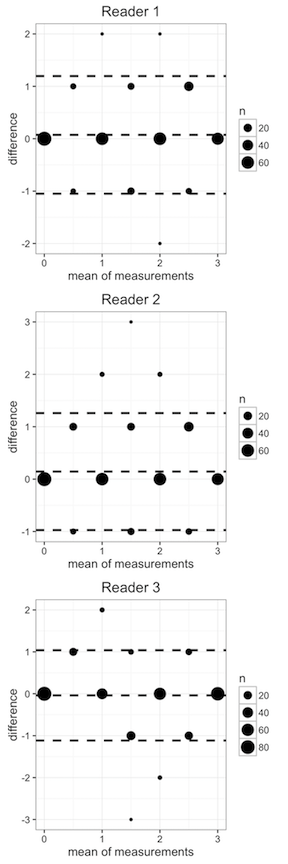
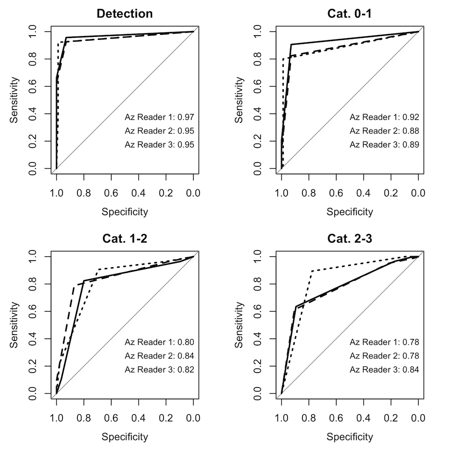
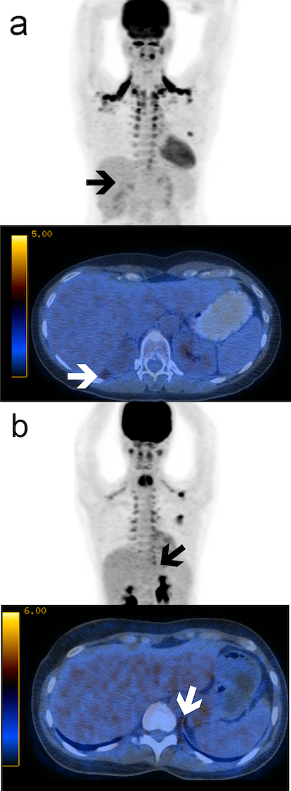

```{r setup, include=FALSE}
knitr::opts_chunk$set(echo = TRUE)
source('../Analysis/readin.R')
source('printCI.R')
#library(ggplot2)
#library(BlandAltmanLeh)
#library(pROC)
library(broom)
library(psych)
library(DescTools)
library(agRee)
```


<center>_This is a preprint version (before peer-review) of the original paper: 10.1016/j.ejrad.2017.03.012_</center>


## Introduction

Obesity has become a serious health problem worldwide. Despite all efforts, obesity is still on the rise globally and the prevalence will surpass 18% in men and 21% in women after 2025 [@ncd2016trends]. Chronic obesity entails several co-morbidities such as type II diabetes, atherosclerotic changes, early osteoarthritis and some types of cancer [@mokdad2003prevalence].
Although various approaches have been undertaken to fight obesity, for example, but not limited to, lifestyle modification or pharmacologic therapy these attempts have, at best, yielded modest results [@kaukua2003behav; @powell2011drug]. For this reason, the initial discovery of metabolically active brown adipose tissue ('brown fat') in adult humans in 2002 [@hany2002] and the subsequent description in a larger human cohort seven years later [@cypess2009bat; @virtanen2009functional] has sparked an active field of research on how to exploit its "calorie burning properties" to facilitate weight loss. The main function of brown fat, as opposed to white fat, which stores excess energy in the form of triacylglycerols, is the dissipation of energy into heat. For this purpose triacylglycerols, amino acids or glucose can be utilized. Thanks to the latter substrate, brown fat can be detected in-vivo by (18)FDG-PET/CT due to its ability to precisely match functional metabolic with spacial anatomic information. To date, (18)FDG-PET hybrid imaging with CT or MRI is the only medical imaging modality able to do so.
Beyond detection, (18)FDG-PET also allows quantification of glycolytic activity in standarized uptake values (SUV). This is of paramount importance in order to be able to evaluate new therapeutic approaches. Bahler and colleagues have recently demonstrated excellent interreader agreement of brown fat SUV measurements [@bahler2016batsuv]. However, the measurement process of brown fat tends to be cumbersome and time-consuming because other glycolytic tissues (myocardium, liver, muscle) need to be manually cropped from the volume of interest. Albeit there are interesting approaches to automate this process such as the one presented by Gifford et al. [@gifford2014auto], they are usually fairly complicated per-se and not readily available. Moreover, specialized software is needed which is usually associated with high costs and a steep learning curve.
Recently, it was shown that more caudal activation of brown fat correlates with all glycolytic measures: SUV~max~, metabolic active volume as well as total brown fat activity [@becker2016bat], which led to the proposal of a three-tier grading system based on the most caudally activated brown fat depot. Such a system allows for faster classification on a standard radiology workstation. Especially for the analysis of larger cohorts this could substantially simplify read outs. However, it is not clear what impact such a grading system will have on the interreader agreement. The binning of continuous SUV measurements, which are very reliable [@bahler2016batsuv], into discrete categories could theoretically lead to more pronounced disagreement. Thus, the purpose of this study was to evaluate the interreader agreement of the three-tier craniocaudal grading system and investigate the accuracy of the readers for the distinction between the three grades.


## Materials and Methods

This retrospective study was approved by the IRB, who waived the need for informed consent.

### FDG-PET/CT protocol

All scans had been acquired as routine clinical examinations. In summary, patients were instructed to fast for at least 6h prior to the examination. Fasting blood glucose was verified to be below <7mmol/L. After injection of 4 mBq FDG per kilogram bodyweight, patients were laid with closed eyes in supine position in a quiet, even-tempered room. After 60 minutes (±5 min.) a low-dose CT scan was acquired (120–140 kV, mAs dynamically regulated by SmartmA (R)), followed by the PET scan from mid-thigh to the vertex of the skull.

### Grading System

The activation strength of the brown fat was divided into four categories according to the grades proposed by [@becker2016bat]: 0 = no active brown fat, 1 = nuchal and/or supraclavicular, 2 = thoracic, 3 = infradiaphragmal fat depots activated, as illustrated in *Figure 1*.

### Patient Population

In a retrospective analysis of roughly 8300 patients undergoing FDG-PET/CT in the years 2007-2015, metabolically active brown fat was detected in 758 patients. Metabolically active brown fat was defined as fat density tissue on CT (-250 to -50 Hounsfield Units) with a corresponding SUV~max~ of >2.5 g/ml. All cases were classified according to the abovementioned three-tier anatomical grading system. From each category 85 cases were randomly selected, resulting in 340 cases.

### Readout

One reader who had performed the initial screening and readout of all PET/CT examinations (ASB) served as a reference standard. Three readers who were blinded to the patient selection independently performed the readout on a standard radiological worksataion (IMPAX, AGFA HealthCare Inc., Bonn, Germany): KS (4th year radiology resident, no prior experience in PET/CT), SB (1st year radiology resident, completed a four-month rotation in PET/CT) and CZ (board certified radiologist, 2 years experience in PET/CT). Prior to the readout four cases not included in the study population were evaluated as training cases. An instruction sheet with a schematic similar to *Figure 1* was available during the readout.

### Statistical Analysis

Statistical Analysis was performed in R version 3.3.2 (R Core Team (2016). R: A language and environment for statistical computing. R Foundation for Statistical Computing, Vienna, Austria; http://www.R-project.org/). Graphs were produced with ggplot2 [@wickham2009ggplot2]. The full data and analysis are available in an online repository at https://github.com/ASBecker/BAT-IRR.

#### Interreader agreement

Interreader agreement for all reader-pairs was investigated with Cohen's weighted kappa (k), which accounts for agreements by chance [@cohen1968weighted], and with the concordance correlation coefficient (CCC) [@lawrence1989concordance] and the intraclass correlation coefficient (ICC) 2k [@shrout1979intraclass]. Since all three metrics are widely used in the radiological literature we opted to calculate and report each to allow better comparability to other studies, which commonly only use one. Scores were considered significantly different if the 95% confidence intervals (CIs) did not overlap and valued as follows: slight (< 0.20), fair (0.20–0.39), moderate (0.40–0.59), substantial (0.60–0.79), and excellent (> 0.80) agreement. 

#### Classification accuracy

The deviation from the reference classification was assessed  with Bland-Altman analysis. Classification accuracy between the subsequent categories (0-1, 1-2 and 2-3) was assessed with a receiving operator characteristics (ROC) analysis. The area under the ROC-curve (A~z~) was compared with DeLong's nonparametric test [@delong1988roc]. A p-value of < 0.016 (<0.05 with Bonferroni correction for 3 combinations, two-tailed alpha) was considered statistically significant.


## Results

All three readers completed the readout successfully for all 340 cases (85 cases per category 1-3 and 85 controls).

#### Interreader agreement

Cohen's k suggested excellent agreement for all reader pairs and ranged between 0.83 and 0.89 with all CIs overlapping, indicating no substantial differences (*Table 1*). The CCC yielded almost identical results, with scores between 0.83 and 0.89 and no significant differences (*Table 2*). The ICC yielded the highest scores ranging from 0.91 to 0.94 (*Table 3*) with again no significant differences between readers.

#### Classification accuracy

As described above, the original readout by BLINDED served as a reference standard. Readers 1 and 2 seemed to slightly overestimate the strength of brown fat activation with a mean difference of 0.07 and 0.14, however, the majority of different ratings did not exceed two categories, as indicated by the dashed lines in *Figure 2a* and *2b*. Reader 3 was closest to the reference standard with a slight underestimation on -0.04 and also most differences one category above or below the reference as shown in *Figure 2c*.
ROC analysis revealed near-perfect brown fat detection for all three readers (A~z~ Reader 1 = 0.97, A~z~ Reader 2 and 3 = 0.95). The classification accuracy was highest for the distinction between categories 0 and 1 (A~z~ 0.92, 0.88 and 0.89) and decreased for categories 1 and 2 (A~z~ 0.80, 0.84, 0.82). In the categories 2 and 3 (the accuracy decreased further for readers 1 and 2 (A~z~ 0.78) and was steady for reader 3 (A~z~ 0.84), as depicted in *Figure 3*. Differences in accuracy among the readers were not significant in all cases (p>0.07).


## Discussion

In the present study we have demonstrated that grading of brown fat activity by assessing the most caudally activated depot results in excellent interreader agreement. Neither overall performance nor agreement was dependent on the experience of the reader, suggesting that the grading system is suitable even for inexperienced radiologists.
However, the two less experienced readers tended to fare slightly worse in the distinction between grade 2 and 3 brown fat activation. This is not surprising since activity the suprarenal brown fat depot, which is most often discriminative of grade 3, can be very subtle (false negative, *Figure 4a*) or mismatched with muscle activity from the crus of the diaphragm (false positive, *Figure 4b*). Moreover, the depot tends to be fairly small in lean people, who are more inclined towards higher levels of brown fat [@becker2016bat; @cypess2009bat; @virtanen2009functional].

In the radiological literature, three of the most widely used metrics for assessing interreader agreement are Cohen's k [@cohen1968weighted], CCC [@lawrence1989concordance] and ICC [@shrout1979intraclass]. The latter is based on underlying ANOVA models, and thus requires the assumption of equally distributed and randomly sampled groups to be true. Although this was provided in our readout set, it may not be given in other study populations and hence yield erroneous results. Alternatively, the CCC is able to provide an estimate for interreader agreement without underlying ANOVA assumptions. However, with given ANOVA assumptions the CCC will yield very similar values to the ICC, as was the case in the present study. Lastly, Cohen's k assesses the agreement of ordinal (categorical) data while taking into account agreement by chance. The weighted k furthermore makes a distinction of how far the disagreements are apart in the case of non-binary categories (m>2). However, it comes at the expense of needing a rather large sample size in order to receive reasonable confidence intervals (n=16m^2 or n=256 in our case), as determined by Chichetti and Fleiss [@cicchetti1977comparison] through Monte-Carlo simulations. The k has another drawback of strongly depending on the prevalence in the study population. This entails that e.g. in a combined detection-and-classification study with the usual observed ~10% active brown fat prevalence, the k will be lower because of the large likelihood of agreements by chance in the remaining 90%. Hence, the CCC may be preferred over k in comparison between different study populations.

Our results are in line with a previous report assessing interreader agreement of SUV measurements of brown fat including SUV~max~, SUV~mean~ and volume [@bahler2016batsuv]. Though the CCC in the present study are slightly lower, they are not unconditionally comparable as the underlying data is different (continuous SUV versus categorical grade). Albeit SUV may appear to offer a very precise measurement of metabolic activity, there are several problems associated with it. First, as mentioned above, SUV assessment requires specialized software and is cumbersome and time consuming, whereas grading on a PACS workstation where the images are readily available is a matter of seconds. Second, SUV vary depeding on uptake time [@kaushik2015estimation] and blood-glucose [@webb2015glucose], which are potential confounders in retrospective (and multi-center) studies. Third, the SUV~mean~ and derived volume depend on an SUV threshold and may thus be biased as well if the threshold is not fixed a priori. Lastly, the SUV~max~ (recommended by [@bahler2016batsuv] for comparison between studies) shows substantial intrascanner and intrasubject variability [@burger2012repeatability; @burger2014pet], which is another source of imprecision. In addition, (18)FDG-PET is limited to quantifying the glucose turnover of a tissue, whereas brown fat is also able to use amino acids and lipids as substrates to a variable degree [@virtanen2009functional; @lopez1988amino]. Due to these limitations, and based on the previously shown excellent correlation between all SUV measurements and the simple categorical brown fat assessment [@becker2016bat], we believe it poses a simple, fast and robust alternative to quantify BAT activity. The exact mechanism of why brown fat activation in humans follows a craniocaudal gradient is still to be determined. It is possible, that the mere location of the activated depots in itself may be indicative of e.g. the intensity of Beta3-adrenergic activation [@cypess2015activation].


## Conclusion

Grading the activation of brown fat by assessment of the most caudally activated depots results in excellent interreader agreement, comparable to previously reported agreement using SUV measurements.


## Conflicts of Interest

The authors of this manuscript declare no relevant conflicts of interest, and no relationships with any companies, whose products or services may be related to the subject matter of the article.

## Figures


Figure 1: Maximum intensity projection PET image depicting a grade 3 activation with lines demarcating the different discriminative depots as proposed in [@becker2016bat]. Brown fat exhibits a cranio-caudal activation pattern. In other words, the more caudally the brown fat is activated, the higher the overall and maximum glucose uptake.


Figure 2: Bland-Altman plots of the three readers. The size of the dots represent the number of cases. The Figures show a slight overestimation by readers 1 and 2 (top and middle) and underestimation by reader 3 (bottom). However, the majority of misclassified cases were only one grade above or below the reference grade.



Figure 3: ROC curves for brown fat detection (top left) and for the distinction between the different categories. Note the decreasing accuracy for the higher grades. The solid line represents Reader 1, the dashed line Reader 2 and the dotted line reader 3.

<!--  #55f 59y 3 2 3 2 #101f 29y 2 2 3 2  -->

Figure 4: a) The suprarenal brown fat in this 59 y/o female patient exhibited only very subtle FDG uptake (arrow), which was missed by 2 readers who falsely graded the patient as grade 2. b) In this 29 y/o female patient, muscle activity from the crus of the diaphragm (arrow) in the vicinity of the suprarenal fat pad led 2 readers to grade the activation too high (grade 3).


## Tables

```{r table1, echo=FALSE}
kappa.wrap <- function(x,y) {cbind(x,y) %>% psych::cohen.kappa(., alpha=0.05) %>% 
    tidy() %>% .[2,c(2:4)] %>% f.ci()}
PairApply(d.readout[,c('BAT','BAT.R1','BAT.R2','BAT.R3')], FUN=kappa.wrap) %>% knitr::kable()
```

Table 1: Weighted Cohen kappa values for the three readers and the reference reader.

```{r table2, echo=FALSE}
pair.ccc <- data.frame(
  'Reference'= c('1',
      agree.ccc(d.readout[,c('BAT','BAT.R1')] %>% as.matrix(), conf.level=0.95) %>% unlist() %>% f.ci(),
      agree.ccc(d.readout[,c('BAT','BAT.R2')] %>% as.matrix(), conf.level=0.95) %>% unlist() %>% f.ci(),
      agree.ccc(d.readout[,c('BAT','BAT.R3')] %>% as.matrix(), conf.level=0.95) %>% unlist() %>% f.ci()),
   'Reader 1'=c(
     agree.ccc(d.readout[,c('BAT','BAT.R1')] %>% as.matrix(), conf.level=0.95) %>% unlist() %>% f.ci(),
     '1',
     agree.ccc(d.readout[,c('BAT.R1','BAT.R2')] %>% as.matrix(), conf.level=0.95) %>% unlist() %>% f.ci(),
     agree.ccc(d.readout[,c('BAT.R1','BAT.R3')] %>% as.matrix(), conf.level=0.95) %>% unlist() %>% f.ci()),
  'Reader 2'=c(
    agree.ccc(d.readout[,c('BAT','BAT.R1')] %>% as.matrix(), conf.level=0.95) %>% unlist() %>% f.ci(),
    agree.ccc(d.readout[,c('BAT.R1','BAT.R2')] %>% as.matrix(), conf.level=0.95) %>% unlist() %>% f.ci(),    
    '1',
    agree.ccc(d.readout[,c('BAT.R2','BAT.R3')] %>% as.matrix(), conf.level=0.95) %>% unlist() %>% f.ci())
   )

knitr::kable(pair.ccc)
```

Table 2: Concordance correlation coefficients for the three readers and the reference reader.

```{r table3, echo=FALSE}
ICC.wrap <- function(x,y) {cbind(x,y) %>% DescTools::ICC(., type='ICC2k', conf.level=0.95) %>% f.ci()}
PairApply(d.readout[,c('BAT','BAT.R1','BAT.R2','BAT.R3')], FUN=ICC.wrap, symmetric=TRUE) %>% knitr::kable()
```

Table 3: Intraclass correlation coefficients for the three readers and the reference reader.

## References
